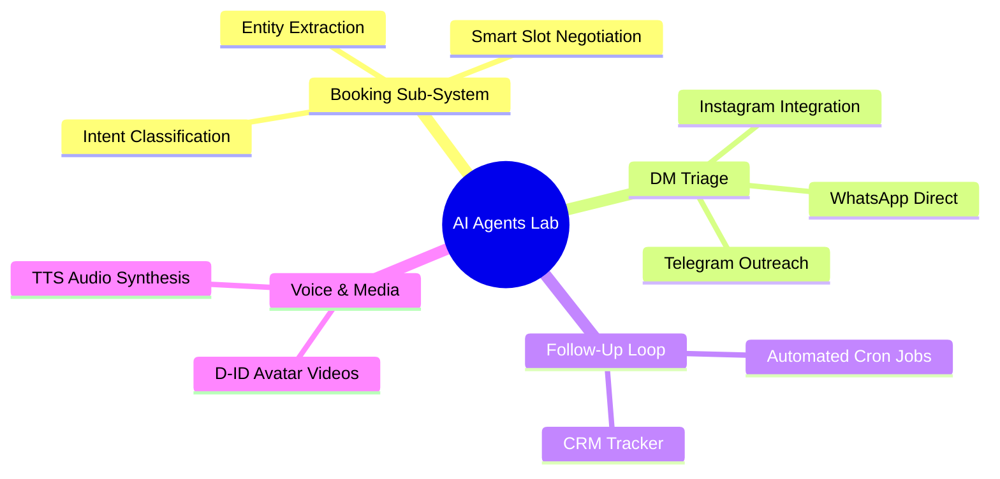
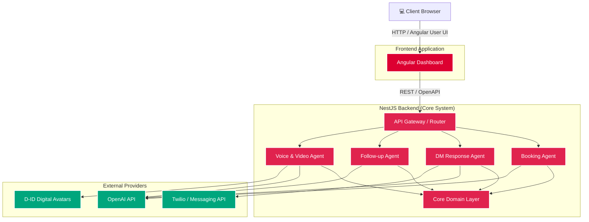
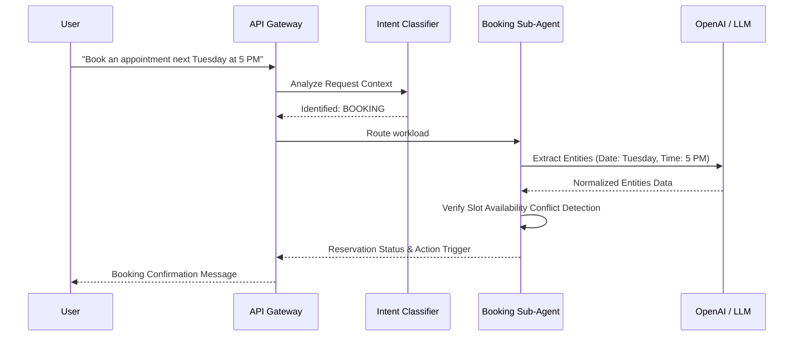
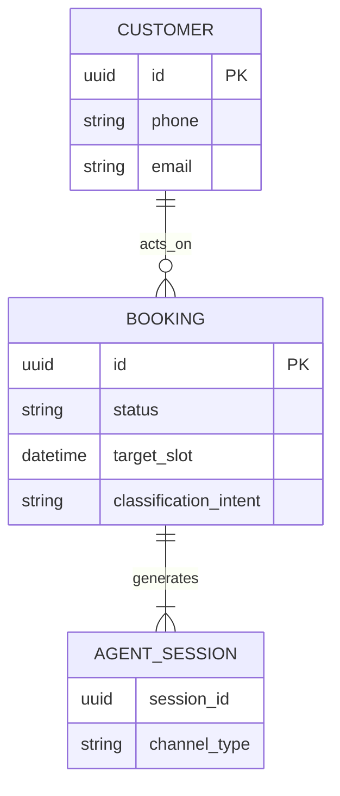
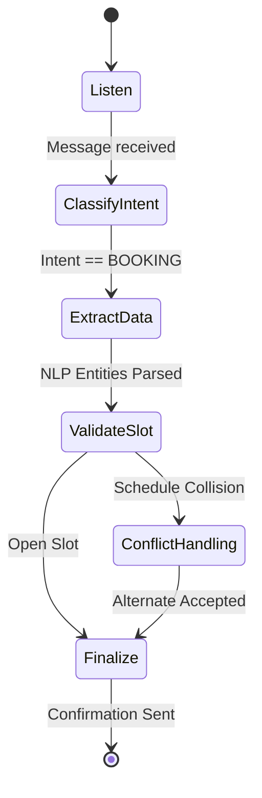

<div align="center">
  <h1>🤖 AI Agents Lab</h1>
  <p><strong>Enterprise-Grade AI Automation Platform</strong></p>
  <p>
    A production-ready platform featuring intelligent automation for booking, customer CRM, follow-ups, and AI voice/video outreach.
  </p>
  
  [](https://nestjs.com/)
  [](https://angular.io/)
  [](https://www.typescriptlang.org/)
  [](https://www.docker.com/)
  [](https://openai.com/)
</div>

---

## 📖 Table of Contents
- [Overview](#-overview)
- [Key Highlights](#-key-highlights)
- [Architecture](#-architecture)
- [AI Agents](#-ai-agents)
- [Project Structure](#-project-structure)
- [Getting Started](#-getting-started)
- [Development Pipeline](#-development-pipeline)
- [Roadmap](#-roadmap)

---

## 🌟 Overview

**AI Agents Lab** orchestrates specialized AI agents to handle complex business automation workflows. The platform encapsulates a **NestJS** microservices backend operating under strict **Domain-Driven Design (DDD)** and **Test-Driven Development (TDD)** paradigms, paired with a modern **Angular** centralized dashboard.

### Ecosystem Mindmap



## 🚀 Key Highlights

*   **Advanced NLP Parsing**: Entity extraction algorithms (dates, times, locations) powered by OpenAI.
*   **Omnichannel Delivery**: Specialized nodes for Instagram, WhatsApp, and Telegram.
*   **Video/Audio Synthesis**: Dynamic text-to-speech and AI avatar video generation using the D-ID API.
*   **Enterprise Architecture**: DDD separation of concerns, ensuring high maintainability and scalability.

---

## 🏗️ Architecture

The system is decoupled into isolated functional units to prevent cascading failures. Each specialized agent operates asynchronously, sharing a Core Domain while interacting with dedicated external APIs.

### High-Level System Architecture



### Request Flow Example: Booking Agent



### Core Entity-Relationship Model



---

## 🤖 AI Agents

The platform includes four standalone AI systems capable of handling precise operations:

### 1. Booking Agent
*   **Purpose**: Automated availability resolution and intent classification.
*   **Features**: Extracting nested entities, intelligent time-slot negotiation.

**Operational State Flow:**



### 2. DM Response Agent
*   **Purpose**: Smart triage and context-aware responses to DMs.
*   **Features**: Multi-channel mapping (IG, WA, TG), brand-tone enforcement.

### 3. Follow-Up Agent
*   **Purpose**: Strategic long-term relationship and conversion management.
*   **Features**: Delayed cron jobs, interaction tracing, CRM updates.

### 4. Voice Agent
*   **Purpose**: Generate dynamic multimedia assets for clients.
*   **Features**: Synthesizing custom D-ID videos, TTS processing.

---

## 📂 Project Structure

```text
ai-agents-lab/
├── backend/                  # NestJS Microservices
│   ├── src/
│   │   ├── agents/           # Specialized Agent Modules (Booking, Voice, etc.)
│   │   ├── core/             # Shared DDD Entities & Value Objects
│   │   └── shared/           # Common Services
│   ├── Dockerfile
│   └── docker-compose.yml
├── frontend/                 # Client UI (Angular 17)
│   ├── src/app/
│   │   ├── components/       # Pages (Landing, Dashboard)
│   │   └── shared/           # UI Atoms (Cards, Metrics, Modals)
│   ├── Dockerfile
│   └── nginx.conf
└── docs/                     # Detailed architectural specs
```

---

## ⚙️ Getting Started

### Prerequisites
*   **Node.js**: v18+ & npm
*   **Docker**: v20+ with Docker Compose
*   **Git**

### Installation & Execution

1. **Clone & Install**
    ```sh
    git clone <repository-url>
    cd ai-agents-lab
    cd backend && npm install
    cd ../frontend && npm install
    ```

2. **Environment Variables**
    Create `.env` in the `backend/` directory:
    ```env
    OPENAI_API_KEY=your_openai_key
    DID_API_KEY=your_did_key
    PORT=3000
    NODE_ENV=development
    ```

3. **Launch the Suite**
    ```sh
    # Option A: Run via NPM unified script
    npm start

    # Option B: Run via Docker Compose
    docker-compose up --build
    ```

    *   **Dashboard**: `http://localhost:4200`
    *   **Swagger API**: `http://localhost:3000/api/docs`

---

## 🛠️ Development Pipeline

### Best Practices

> [!TIP]
> We enforce strict **DDD** and **TDD**. Ensure you write the tests *before* writing the target implementation logic to hit the >90% coverage benchmarks.

*   **Test-Driven Execution**: `npm run test` ensures Domain entities, logic, and controllers meet requirements.
*   **Linting & Quality**: Commits should pass `eslint` and `prettier` pre-hooks.

### Containerization Strategy
*   Multi-stage Docker builds minimize footprint and reduce attack surfaces.
*   The `frontend` leverages Nginx as a reverse proxy for optimal delivery of compiled Angular bundles.

---

## 🗺️ Roadmap & Security View

- [x] **Core System Module Integrations**
- [x] **Agent Infrastructure (Booking, DM, Follow-up, Voice)**
- [x] **Container Delivery Pipeline**
- [ ] **Data Persistence Strategy** (PostgreSQL/MongoDB)
- [ ] **Observability Stack** (Prometheus, Grafana Setup)
- [ ] **Advanced Cloud Security** (RBAC, Rate Limiting Overlays)

---

<div align="center">
  <p>Engineered with ❤️ by the AI Agents Lab Team.</p>
  <i>Empowering teams to do more with Artificial Intelligence.</i>
</div>
